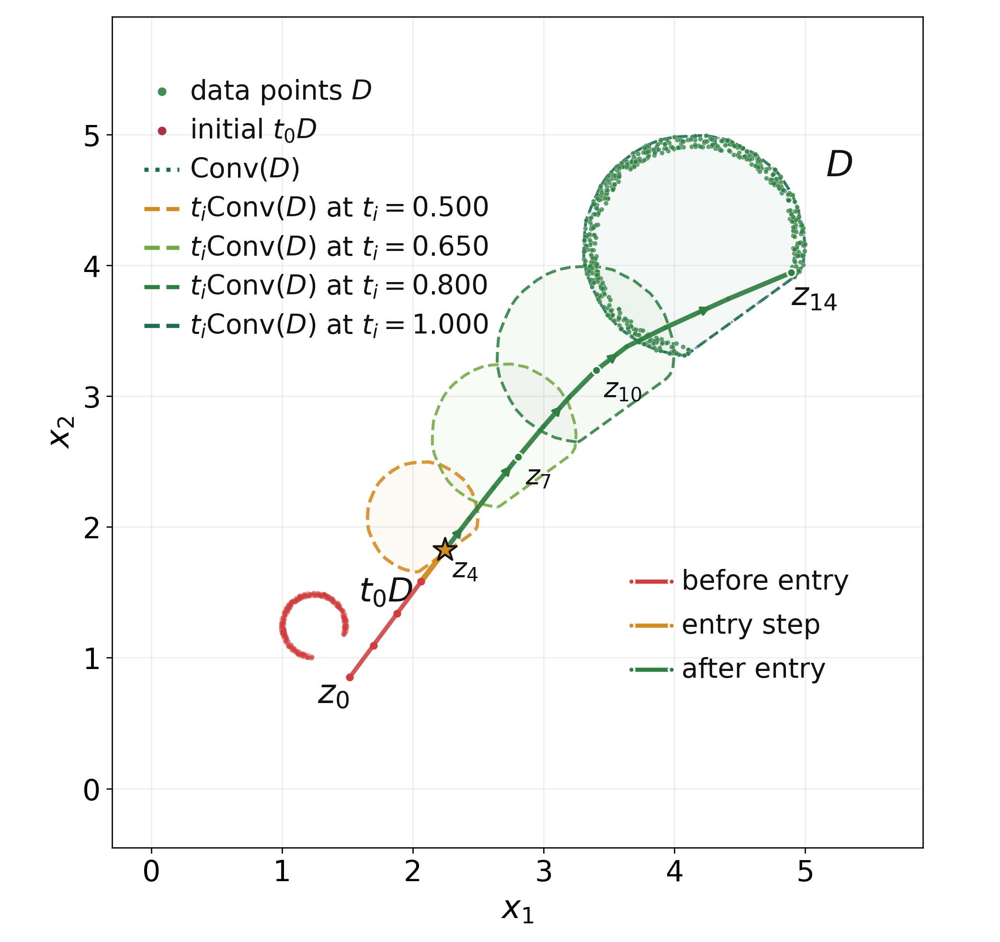
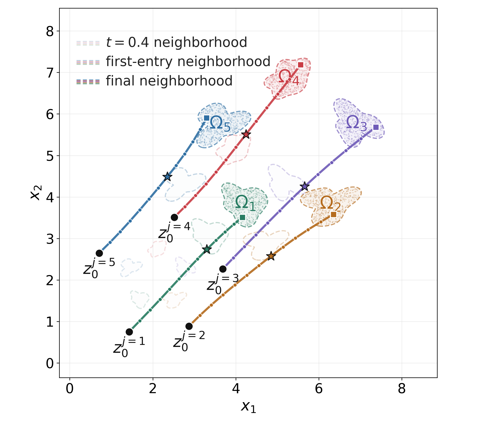
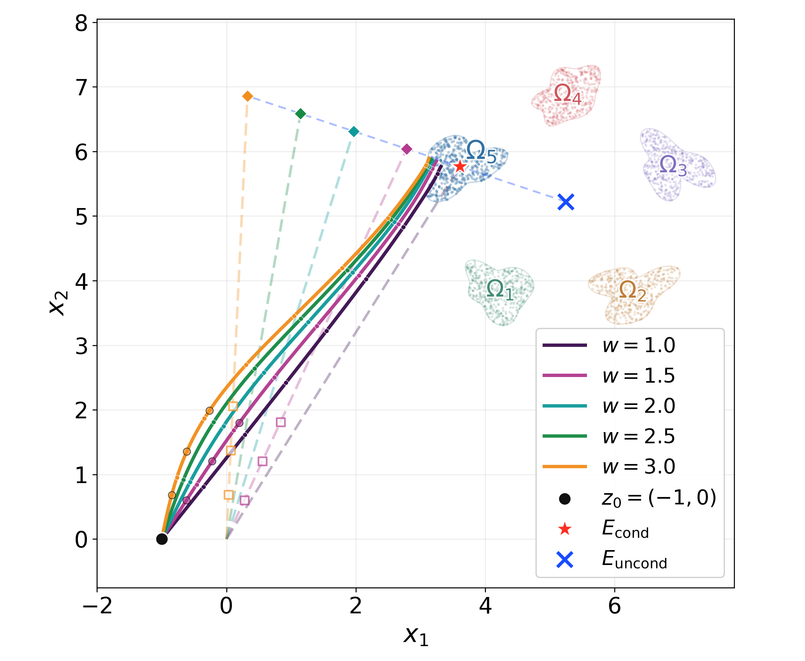

# Supplementary 2D Experiments

This repository provides the implementation and reproducibility details for the two-dimensional synthetic experiments in

> **Particle Dynamics of Flow Matching and Classifier-Free Guidance from a Stagewise Geometry Perspective**
>
> Jian-Feng Cai, Zhengyi Su, and Chao Wang
>
> [arXiv:2609.06947](https://arxiv.org/abs/2609.06947)

The experiments illustrate the stagewise geometric behavior proved in the paper: attraction to the scaled data convex hull, final-stage attraction to local cluster neighborhoods, and the effect of classifier-free guidance (CFG) on early and late trajectory geometry. They reproduce Figures 5–9 in arXiv v1.

## Scope

All examples use synthetic data in two dimensions. The data are generated at runtime from fixed random seeds, so no datasets, checkpoints, or GPUs are required. This repository does not include the conceptual illustrations in Figures 1–4 or the image experiments in Figures 10–13.

| Paper figure | Geometric phenomenon | Command |
| --- | --- | --- |
| Figure 5 | Convex-hull attraction and absorption | `python reproduce.py --experiment convex-hull` |
| Figure 6 | Final local-cluster attraction and absorption | `python reproduce.py --experiment local-clusters` |
| Figure 7 | CFG trajectory geometry and final cluster distance | `python reproduce.py --experiment cfg` and `--experiment cfg-final` |
| Figure 8 | Early attraction to the extrapolated CFG mean | `python reproduce.py --experiment cfg` |
| Figure 9 | Final-stage prediction-gap decay | `python reproduce.py --experiment cfg` |

| Convex-hull absorption | Local-cluster absorption | CFG trajectories |
| --- | --- | --- |
|  |  |  |

## Mathematical setup

For the linear interpolation

$$
X_t=tY+(1-t)Z,
$$

where `Y` follows the data distribution and `Z` is standard Gaussian noise, the ideal unconditional flow used in the experiments is

$$
v_t(x)=\frac{\mathbb{E}[Y\mid X_t=x]-x}{1-t}.
$$

The posterior expectation is evaluated from the finite synthetic sample with Gaussian likelihood weights. Trajectories are integrated with explicit Euler steps. The conditional and unconditional posterior means are combined under CFG as

$$
m_{\mathrm{cfg}}(x,t;w)
=m_{\mathrm{uncond}}(x,t)
+w\bigl(m_{\mathrm{cond}}(x,t)-m_{\mathrm{uncond}}(x,t)\bigr),
$$

$$
v_t^{\mathrm{cfg}}(x;w)=\frac{m_{\mathrm{cfg}}(x,t;w)-x}{1-t}.
$$

With this convention, $w=1$ gives the conditional flow. The plotted “continuous” trajectory in the convex-hull experiment is a fine-step Euler approximation rather than an exact ODE solution.

## Experiment details

### Convex-hull attraction and absorption — Figure 5

The data distribution is approximated by 500 samples from a nonconvex crescent-shaped region using seed `7`. The code tracks the distance from the Euler iterate $z_i$ to the moving set $t_i\operatorname{Conv}(\mathcal D)$ and marks the first entry. It evaluates step sizes `0.1`, `0.05`, and `0.025`, together with a fine-step reference using `0.002`. Figure 5 uses the `0.05` run.

Main script: `experiments/sec5_flow_ode_discrete_absorption.py`

### Local-cluster attraction and absorption — Figure 6

The synthetic distribution consists of five separated nonconvex clusters, with 500 samples per cluster and seed `20260514`. Five Euler trajectories are initialized at $t=0.4$ and evolved with step size `0.05`. The moving target for each trajectory is $t_i B_r(\Omega_j)$, with neighborhood radius $r=0.025$. The plot reports the first entry and verifies that the discrete trajectory remains in the corresponding neighborhood afterward.

Main script: `experiments/sec5_final_local_cluster.py`

### Classifier-free guidance — Figures 7–9

The CFG experiment uses the fifth cluster as the conditional target and integrates from a common initial point with step size `0.001`. Guidance scales are `1`, `1.5`, `2`, `2.5`, and `3`.

- Figure 7 compares the full trajectories and the distance to $tB_{0.05}(\Omega_5)$ for $w=1,1.5,3$.
- Figure 8 measures early-stage distance to the moving ball centered at the extrapolated mean for $w=1.5,3$.
- Figure 9 fits the measured prediction gap on $t\in[0.35,0.85]$ to $\frac{C_1}{1-t}\exp\!\left(-\frac{C_2}{(1-t)^2}\right)$.

Main scripts: `experiments/sec6_cfg_early_attraction.py` and `experiments/sec6_cfg_final_cluster_distance.py`

## Reproduction

Python 3.9 or newer is recommended.

```bash
git clone https://github.com/LeonSuZhengYi/Particle-Dynamics-of-Flow-Matching.git
cd Particle-Dynamics-of-Flow-Matching
python3 -m venv .venv
source .venv/bin/activate
python -m pip install -r requirements.txt
python reproduce.py
```

The final command runs all experiments. To run one part or choose another output directory:

```bash
python reproduce.py --experiment local-clusters
python reproduce.py --experiment cfg --output-dir results/cfg
```

Generated figures, console logs, and `run-manifest.json` are written to `outputs/` by default. The manifest records package versions, exit codes, and runtimes. Generated files are excluded from version control. Each experiment script can also be executed directly.

The standard dependencies are listed in `requirements.txt`. `requirements-tested.txt` records the exact environment used for the reference validation.

## Output-to-figure map

| Paper figure | Output file |
| --- | --- |
| Figure 5, left | `convexhull_z.png` |
| Figure 5, right | `dist_conv_z.png` |
| Figure 6, left | `cluster_z.png` |
| Figure 6, right | `dist_cluster_z.png` |
| Figure 7, left | `sec6_cfg_z.png` |
| Figure 7, right | `sec6_cfg_final_cluster_distance_r005.png` |
| Figure 8, left/right | `sec6_cfg_early_distance_w15.png`, `sec6_cfg_early_distance_w30.png` |
| Figure 9, left/right | `sec6_cfg_prediction_gap_fit_w15_z.png`, `sec6_cfg_prediction_gap_fit_w30_z.png` |

The scripts save the panels separately; the paper combines them in its typeset two-column layout. The convex-hull script additionally saves the other step-size comparisons.

## Code organization

```text
experiments/
  sec4.py                                  shared geometry and flow utilities
  sec5_flow_ode_discrete_absorption.py     convex-hull experiment
  sec5_final_local_cluster.py              local-cluster experiment
  sec6_cfg_early_attraction.py             CFG trajectories, early distance, and gap fit
  sec6_cfg_final_cluster_distance.py       CFG final-cluster distance
  output_paths.py                          common output-directory handling
reproduce.py                               experiment runner and run manifest
```

The historical section-based filenames are retained to preserve the connection with the research code. Named constants near the beginning of each script contain the seeds, time intervals, step sizes, neighborhood radii, and plotting settings.

## Validation

All four experiment entry points were rerun on macOS with Python 3.9.6, NumPy 2.0.2, SciPy 1.13.1, and Matplotlib 3.9.4. They produced the ten panels listed above, plus the convex-hull step-size comparisons. The ten paper panels matched the original locally saved figures pixel for pixel in this environment. Small rendering differences may occur with other library versions or operating systems.

## Citation

```bibtex
@misc{cai2026particle,
  title={Particle Dynamics of Flow Matching and Classifier-Free Guidance from a Stagewise Geometry Perspective},
  author={Jian-Feng Cai and Zhengyi Su and Chao Wang},
  year={2026},
  eprint={2609.06947},
  archivePrefix={arXiv},
  url={https://arxiv.org/abs/2609.06947}
}
```
